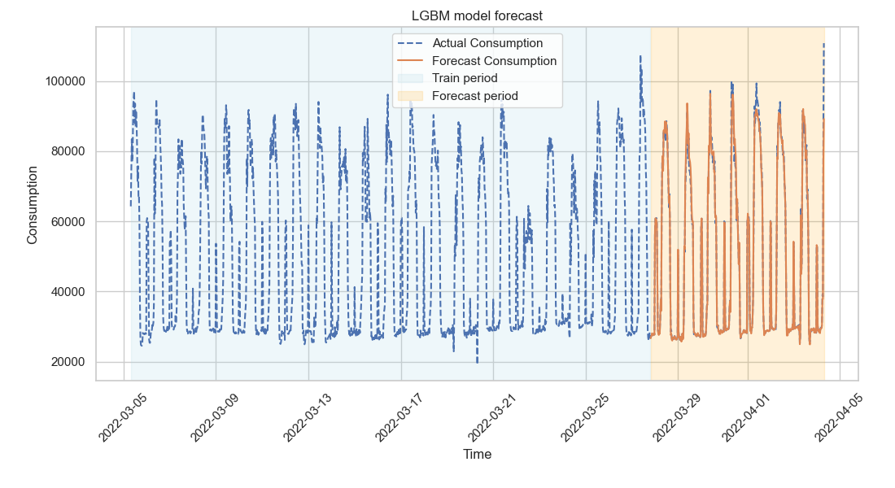

## Simple time-series model

A Python implementation of the time-series model for the task outlined in `Task.pdf`. See the following sections for installation and usage. The whole solution is outlined in the last section.

### Installation

All Python requirements should be specified in `requirements.txt` file.
After you set up and activate a [virtual environment](https://docs.python.org/3/library/venv.html), just install the requirements with (it may take a minute):

```
pip install -r requirements.txt
```

I tested everything on Windows and Ubuntu, so hopefully there are no issues.

### Usage

Use `time_series.py` script to run the whole process. The full usage is following: 
```
time_series.py [-h] -i INPUT -q QUANTITY [-o OUTPUT] [-v] [-m {VAR,LGBM}]
```

The input is a CSV data file, and quantity is the variable to model.
You can provide a path where the generated plot would be saved as PNG. If not provided, the plot is only opened in a console. Lastly, verbosity and the model variant can be selected (LGBM with no progress prints is used by default). The evaluation metric details are printed at the end. Use `python time_series.py -h` for further details.

You can run the whole program with the given example data using the command below. It should take several seconds for the VAR model and up to 2 min for the LGBM due to the cross-validation runs.
```
python time_series.py -i data/data.csv -q "Consumption" -o "example-forecast.png"
```

Additionaly, some initial data exploration and visualization is provided in Jupyter notebook `explore.ipynb`.


### Tests

Very simple prototype test suite is provided in `unit_test.py`. Run them with:
```
python -m unittest unit_test.py -v
```

### Solution details

First, the multi-variate time-series data is loaded and pre-processed. Constant features are filtered out, data is imputed and scaled. The data is split into a "training" part (head of the series) and a "testing" part (tail of the series).
A model is then created using the training part. First, values for some parameters are picked using cross-validation scores (this is just a placeholder for a proper parameter search). Then, a model is fitted on the full training data. This fitted model is then used to forecast for the whole testing period. Finally, forecasted values are compared to the actual test values and a plot comparing both series is generated.

I chose mean average error (MAE) for the evaluation, as it is somehow more interpretable than some squared variant. MAE reports the average difference between forecasted and actual values. Squared error could be considered if the predictions of peaks are of special interest. I report two versions of the MAE score:
- MAE for the original data scale (i.e., in the original units)
- MAE for zero-one scaled data. This value usually ranges between \[0,1\], resulting in easier interpretation, and can be compared across variables with different scale

I played with two modelling approaches - vector autoregression and gradient boosting. I wanted to also use some ARIMA variant, but it was usually pretty slow to fit.
- `VAR` (vector autoregression) is a simple statistical method to model multiple variables. In the script, I use VAR to forecast a combined vector of all quantities, based on their past values. I used VAR from the `sktime` library.
- `LGBM` is a gradient boosting model from the `lightgbm` library. I used its regression version, adapted for forecasting using a rolling window approach. I made it to forecast a single quantity based on both its past values, and values of other (exogenous) quantities. 

The VAR model is less precise, but it can be used to forecast for periods where we don't have measurements for any of the quantities at all. LGBM is more precise and it is suitable when forecasting some quantity for periods where we can utilize measurements of other exogenous quantities. Both models are less reliable for quantities with non-uniform seasonality (e.g., battery charging, pv generation), which would need further processing.

Below is an example plot of the `Consumption` forecast generated by the LGBM model:


